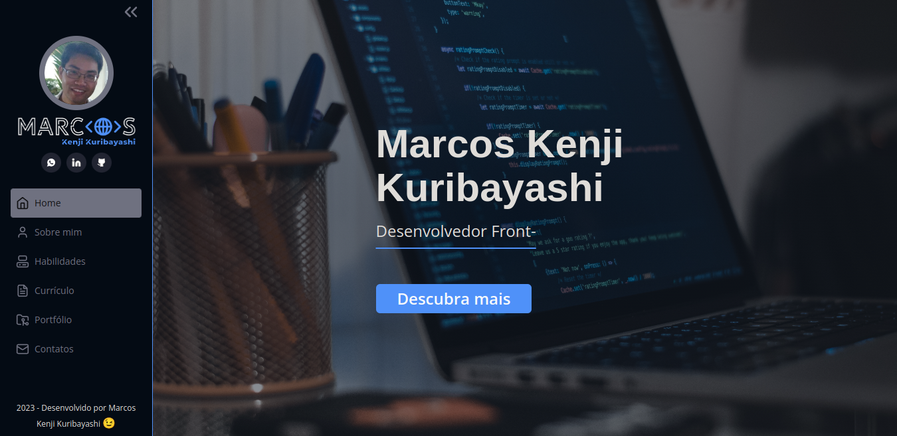
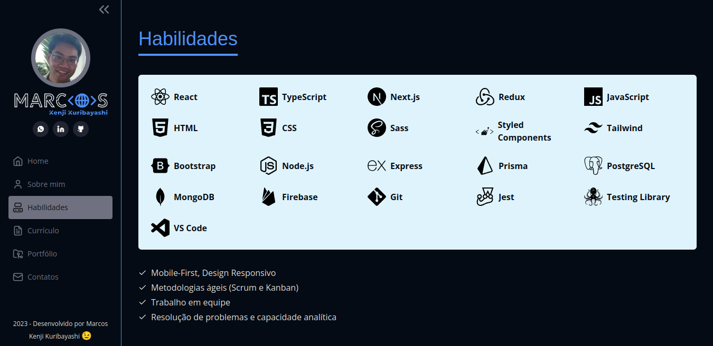
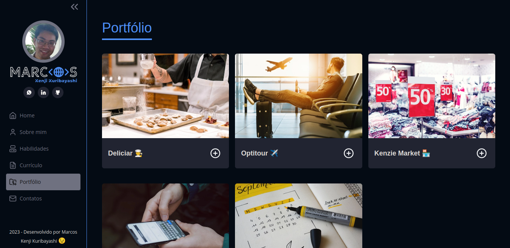
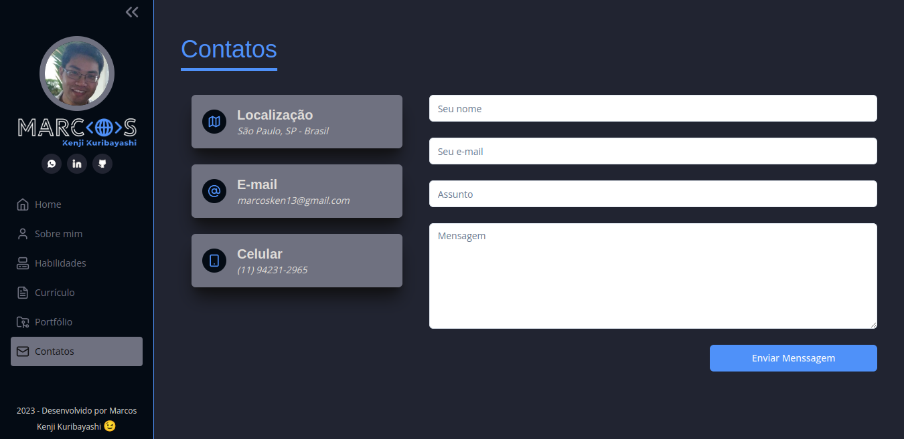

<!-- CABEÇALHO -->

    <h1>
        
    </h1>
    

        Meu Portfólio
    

    

        <a href="#%EF%B8%8F-sobre-o-projeto">Sobre o Projeto</a> •
        <a href="#-funcionalidades">Funcionalidades</a> •
        <a href="#-layout">Layout</a> •
        <a href="#%EF%B8%8F-tecnologias">Tecnologias</a> •
        <a href="#-autor">Autor</a>
    

<!-- SOBRE O PROJETO -->

## 🖥️ Sobre o Projeto

    
     
     
    

 

Este projeto é uma nova versão do meu portfólio que desenvolvi com base em meus conhecimentos em programação.

O objetivo desse portfólio é servir como um reflexo da minha jornada de aprendizado e conquistas no área do desenvolvimento de software. Este espaço reúne informações gerais sobre mim e sobre a minha trajetória profissional, além de uma seleção de projetos que demostram minhas habilidades.

A aplicação foi construída utilizando TypeScript, React, Next.js, Tailwind, GraphQL, entre outros.

<!-- FUNCIONALIDADES -->

## 💡 Funcionalidades

- [x] Tela Home
  - [x] Informações gerais sobre mim
  - [x] Link para acessar meu LinkedIn
  - [x] Informações sobre minhas habilidades
- [x] Tela Portfólio
  - [x] Lista com alguns projetos que desenvolvi
  - [x] Link para acessar meu GitHub
- [x] Tela Contatos
  - [x] Informações de contato
  - [x] Envio de mensagem
- [x] Sidebar
  - [x] Link para acessar meu currículo

<!-- LAYOUT -->

## 🎨 Layout

  

  

  

## 🛠️ Tecnologias

Para o desenvolvimento desse projeto, as seguintes ferramentas foram utilizadas:

- **[Next.js](https://nextjs.org/)**
- **[TypeScript](https://www.typescriptlang.org/)**
- **[React.js](https://pt-br.reactjs.org/)**
- **[Tailwind](https://tailwindcss.com/)**
- **[Shadcn](https://ui.shadcn.com/)**
- **[Hygraph](https://hygraph.com/)**
- **[GraphQL](https://graphql.org/)**
- **[Apollo](https://www.apollographql.com/)**
- **[React Hook Form](https://react-hook-form.com/)**
- **[Zod](https://zod.dev/)**
- **[Nodemailer](https://nodemailer.com/)**

## 👨‍💻 Autor

Marcos Kenji Kuribayashi

 

---

Desenvolvido por Marcos Kenji Kuribayashi 😉
